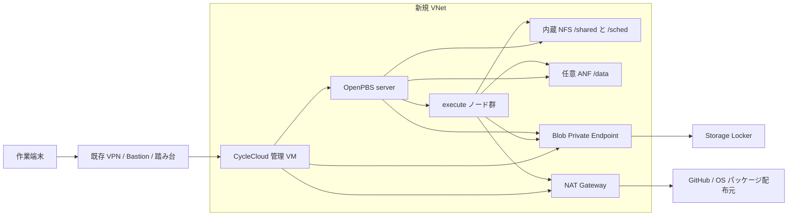

# Azure CycleCloud で OpenPBS クラスタを展開・活用する

## 1. はじめに

[Azure CycleCloud で Slurm クラスタを展開/活用](https://zenn.dev/kaikurahky/articles/5252f707f38e2f)の OpenPBS 版です。Azure 基盤を Terraform で用意し、CycleCloud の初期設定後に公式 [Azure/cyclecloud-pbspro](https://github.com/Azure/cyclecloud-pbspro) を登録します。最後に単体ジョブと Ethernet 経由の 2 ノード MPI を確認します。

この手順は新しい検証環境を作ります。既存 Slurm 環境の state や RG は流用しません。コマンドの実行場所を **作業端末**、**CycleCloud サーバ**、**PBS server** に分けています。



Terraform が管理するのは Azure 基盤と CycleCloud VM です。PBS server、execute、クラスタ用ディスクなどは CycleCloud が作成・管理します。

## 2. 事前準備

### 2.1 必要な権限とツール

**作業端末:** Linux または WSL2、Bash 4 以上、Git、curl、jq、OpenSSH、Azure CLI、Terraform 1.14 以上。ローカル検証には ShellCheck も必要です。Private リポジトリの clone には GitHub のアクセス権と認証が必要です。GitHub CLI は clone の補助で、展開自体には不要です。

```bash
az version
terraform version
git --version
jq --version
shellcheck --version
```

**Azure 権限:** 対象サブスクリプションで RG・リソースを作成できること。さらに RBAC のロール割り当て権限が必要です。例は Owner、または Contributor と Role Based Access Control Administrator の組み合わせです。組織側の条件付き RBAC、Azure Policy、Marketplace 制限が優先されます。

本サンプルは CycleCloud 管理 ID にサブスクリプションの Contributor を割り当てます。これはクラスタ別 RG を CycleCloud が作成する方式に合わせた検証用の選択です。本番では [公式のカスタムロール](https://learn.microsoft.com/azure/cyclecloud/how-to/managed-identities?view=cyclecloud-8)と管理対象スコープへの制限を検討してください。

### 2.2 ネットワークと費用を確認する

- 新しい VNet と既存ネットワークの CIDR が重複していないこと。
- CycleCloud の Private IP への SSH/9443 到達経路を確保すること。この Terraform は Bastion、VNet Peering、VPN Gateway、ExpressRoute を作りません。
- クラスタから CycleCloud、内蔵 NFS、Blob Private Endpoint、DNS へ到達できること。
- GitHub のリリース配布先、AlmaLinux リポジトリ、Azure 管理 API などへアウトバウンド通信できること。独自 Firewall/UDR/Proxy を使う場合は別途許可が必要です。
- 独自 DNS を使う場合は Blob の Private DNS を解決できるよう条件付きフォワーダー等を設定すること。端末の hosts 書き換えだけでは計算ノードの問題は解消しません。

既定値は管理 VM が 4 vCPU、PBS server が 4 vCPU、execute 上限が 8 vCPU です。同じ VM ファミリを使う場合は少なくとも計 16 vCPU 分に既存利用分を加えたクォータを確認します。`MaxExecuteCoreCount` は**台数ではなくコア数**です。実際の割り当て可否はリージョン容量にも依存します。

既定では Spot を使いません。Spot に変更する場合は通常の VM ファミリ枠とは別に、リージョン共通の Spot vCPU クォータを確認してください。

ANF は Flexible pool 1 TiB / 128 MiB/s、ボリューム 1024 GiB を作ります。リージョン対応・クォータ・料金を確認してください。小規模検証では `TF_VAR_enable_anf=false` と `PBS_USE_ANF=false` を指定して内蔵 NFS だけにできます。NAT Gateway、Public IP、Managed Disk、Blob などの料金は別途発生します。公式 OpenPBS テンプレートは `/sched` 用に 1024 GiB のディスクを作るため、管理 VM と計算 VM の料金だけで見積もらないでください。

### 2.3 clone と設定

**作業端末:**

```bash
gh repo clone kaikurahky/cyclecloud-openpbs-deploy-tf
cd cyclecloud-openpbs-deploy-tf
cp config/cyclecloud.env.example config/cyclecloud.env
cp config/openpbs.env.example config/openpbs.env
```

GitHub CLI がない場合は、アクセス権のある Git 認証を設定して `git clone https://github.com/kaikurahky/cyclecloud-openpbs-deploy-tf.git` を使います。PAT を URL や設定ファイルへ書かないでください。

必要なら SSH 鍵を新規生成します。既存の鍵を上書きしないでください。

```bash
ssh-keygen -t rsa -b 3072 -f ~/.ssh/cyclecloud_openpbs
```

[config/cyclecloud.env.example](../config/cyclecloud.env.example) を参考に、実設定を編集します。

| 入力 | 設定内容 |
| --- | --- |
| `TF_VAR_subscription_id` | 自分のサブスクリプション ID |
| `TF_VAR_name_prefix` | 新環境固有の接頭辞。既存 Slurm 環境と分離する |
| `TF_VAR_storage_account_name` | Azure 全体で一意な英小文字・数字 3～24 文字 |
| `TF_VAR_management_source_cidrs` | 自分の VPN クライアント、踏み台、Bastion サブネット等の CIDR を JSON 配列で指定 |
| `TF_VAR_*_cidr` | 重複しない VNet と各サブネットの CIDR |
| `SSH_PUBLIC_KEY_FILE` | 例: `$HOME/.ssh/cyclecloud_openpbs.pub`。秘密鍵ではない |
| `TF_VAR_cyclecloud_image_urn` | 次項で確認した CycleCloud イメージ |
| `TF_VAR_image_data_disk_luns` | イメージに含まれるデータディスクの LUN 一覧 |
| `TF_VAR_enable_anf` | ANF が必要なら `true` |

`TF_VAR_management_source_cidrs` の例 `10.60.254.0/26` は Bastion 用の予約例で、Bastion を作成する指定ではありません。また NSG の既定 `AllowVNetInBound` は維持されます。VNet 内の通信も厳密に制限する場合は PBS、NFS、MPI、CycleCloud の通信設計と合わせて変更してください。

設定は Bash として source されます。第三者から受け取った未確認の設定を実行しないでください。

### 2.4 Azure ログインと Resource Provider 登録

```bash
az login
source config/cyclecloud.env
az account set --subscription "$TF_VAR_subscription_id"
az account show --query '{name:name,id:id,tenant:tenantId}' -o table

for provider in Microsoft.Compute Microsoft.Network Microsoft.Storage Microsoft.ManagedIdentity Microsoft.Resources Microsoft.MarketplaceOrdering; do
  az provider register --namespace "$provider" --wait
done
```

ANF を有効にする場合:

```bash
az provider register --namespace Microsoft.NetApp --wait
```

Terraform Provider 自体の自動登録は無効にし、この明示的な事前準備に寄せています。権限不足なら管理者へ登録を依頼してください。

### 2.5 イメージ、利用規約、VM サイズ、クォータ

```bash
az vm image list --location "$TF_VAR_location" \
  --publisher azurecyclecloud --offer azure-cyclecloud \
  --sku cyclecloud8-gen2 --all -o table

az vm image show --location "$TF_VAR_location" \
  --urn "$TF_VAR_cyclecloud_image_urn" \
  --query '{name:name,plan:plan,dataDisks:dataDiskImages}' -o json

az vm image terms show --urn "$TF_VAR_cyclecloud_image_urn"
```

利用規約を確認し、受諾権限がある場合のみ次を実行します。

```bash
az vm image terms accept --urn "$TF_VAR_cyclecloud_image_urn"
```

規約受諾はサブスクリプション共通の設定のため、Terraform の作成・削除対象には含めません。既存 Slurm 環境の規約リソースと競合しない構成です。

イメージの `dataDiskImages[].lun` に合わせて設定を編集します。例は `[0]` です。CycleCloud データを含むイメージ内ディスクを落とさないよう、VM は Terraform から ARM Template の `FromImage` で作成しています。

クラスタ OS と VM サイズも確認します。

```bash
source config/openpbs.env
az vm image show --location "$PBS_REGION" --urn "$PBS_IMAGE" \
  --query '{name:name,plan:plan}' -o json
az vm list-skus --location "$PBS_REGION" --size "$PBS_EXECUTE_VM_SIZE" --all -o table
az vm list-usage --location "$PBS_REGION" -o table
```

クラスタ OS の `plan` が null 以外なら、その規約も `az vm image terms show --urn "$PBS_IMAGE"` で確認し、同意後に `accept` してください。管理 VM と PBS ノード OS は別イメージです。`PBS_REGION` は基盤のリージョンと一致させます。

## 3. Terraform で Azure 基盤を展開する

**作業端末:**

```bash
bash scripts/plan.sh
bash scripts/deploy.sh
terraform -chdir=infra output
```

どちらも init、validate、事前確認を行います。`deploy.sh` は変更計画を表示し、`yes` の入力後に apply します。自動承認はしません。別設定ファイルを使う場合は `bash scripts/deploy.sh /absolute/path/lab.env` のように渡せます。

主な出力は次のとおりです。

| 出力 | 用途 |
| --- | --- |
| `cyclecloud_private_ip` / `cyclecloud_portal_url` | 管理接続 |
| `cyclecloud_vm_id` | Bastion の対象 |
| `managed_identity_client_id` | CycleCloud Azure 資格情報の Client ID |
| `locker_identity_id` | Storage Locker と PBS ノードの読み取り専用 ID |
| `storage_account_name` | Locker の Storage Account |
| `cluster_subnet_cyclecloud` | `RG/VNet/Subnet` 形式のクラスタ入力 |
| `anf_mount_ip` / `anf_export_path` | 追加 NFS `/data` の接続先 |

ARM 形式の `cluster_subnet_id` と CycleCloud 用の短い `cluster_subnet_cyclecloud` は別です。後者を OpenPBS テンプレートに渡してください。

state とバックアップには環境情報が含まれます。リポジトリを消す前に安全な保管先を確保してください。チーム運用では別管理の Azure Storage backend 等を設計してください。同じ state に異なる環境の設定を交互に適用しないでください。

## 4. CycleCloud サーバを初期設定する

### 4.1 管理画面と SSH への接続

直接到達できる場合は出力の `https://<private-ip>:9443` を開きます。証明書警告は自己署名証明書の場合に発生するため、接続先を確認してから対応してください。本番では信頼された証明書を設定します。

既存の Bastion Standard 以上で native client/tunneling が有効な場合は、**作業端末**で次を実行できます。Bastion から新規 VNet への経路も必要です。

```bash
CC_VM_ID=$(terraform -chdir=infra output -raw cyclecloud_vm_id)
az network bastion tunnel --name YOUR_BASTION_NAME \
  --resource-group YOUR_BASTION_RESOURCE_GROUP \
  --target-resource-id "$CC_VM_ID" --resource-port 9443 --port 19443
```

トンネルを起動したまま `https://localhost:19443` を開きます。SSH 用は別ターミナルで:

```bash
CC_VM_ID=$(terraform -chdir=infra output -raw cyclecloud_vm_id)
az network bastion tunnel --name YOUR_BASTION_NAME \
  --resource-group YOUR_BASTION_RESOURCE_GROUP \
  --target-resource-id "$CC_VM_ID" --resource-port 22 --port 10022
```

```bash
ssh -i ~/.ssh/cyclecloud_openpbs -p 10022 azureuser@127.0.0.1
```

### 4.2 サービス・DNS 確認

**CycleCloud サーバ:**

```bash
systemctl status cycle_server --no-pager
systemctl status cycle_server_webserver --no-pager
ss -lnt | grep 9443
cyclecloud --version
```

サービス名はイメージにより異なる場合があります。`systemctl list-units --all '*cycle*'` で確認します。

```bash
getent hosts YOUR_STORAGE_ACCOUNT.blob.core.windows.net
curl -I https://YOUR_STORAGE_ACCOUNT.blob.core.windows.net
```

名前解決先が Private Endpoint の IP になっていることを確認します。未認証の HTTP 400/403 は疎通確認には使えますが、認証成功を示しません。タイムアウトや公開 IP への名前解決ならネットワーク/DNS を修正してください。

### 4.3 管理者・Azure 資格情報・Locker

Web の初回画面でサイト名、管理者、パスワード、SSH **公開鍵**を登録します。本手順ではクラスタへのログイン名も `azureuser` とする例です。パスワードや秘密鍵を Terraform、env、Git に保存しません。

Azure アカウント設定は次の値を使用します。

| UI 項目 | 入力 |
| --- | --- |
| Subscription Name / アカウント表示名 | `azure-openpbs`。任意の資格情報名で、Azure サブスクリプション ID や Linux ユーザー名ではない |
| Authentication | Managed Identity |
| Subscription ID | 自分の Azure Subscription ID |
| Client ID | `managed_identity_client_id` |
| Storage Resource Group | `resource_group_name` |
| Storage Authentication | Use managed identity for storage access |
| Locker identity | `locker_identity_id` に対応する読み取り専用 ID |
| Storage account | `storage_account_name` |

`Validate Credentials` の成功と保存を確認します。管理用 ID は Blob 書き込み権限、Locker ID はクラスタからの読み取り権限を持っています。RBAC が反映されるまで時間がかかる場合があります。

**CycleCloud サーバ:**

```bash
cyclecloud initialize
cyclecloud locker list
cyclecloud show_cluster
```

URL はサーバから到達可能な管理 URL を指定し、Web で作った管理者の資格情報を対話入力します。CLI の保存設定にも認証情報が含まれるため、ホームディレクトリを共有・公開しないでください。パスワードをコマンドライン引数に付けません。

## 5. 公式 OpenPBS プロジェクトを登録する

### 5.1 クラスタ入力を生成する

**作業端末:** 実設定の `PBS_CREDENTIALS` を前項の資格情報名に合わせます。既定は server/execute とも `Standard_D4as_v5`、execute 上限 8 コア、通常価格 VM、ログイン専用ノード 0 台です。

```bash
mkdir -p work
umask 077
terraform -chdir=infra output -json > work/infra-outputs.json
bash scripts/render-parameters.sh work/infra-outputs.json config/openpbs.env \
  > work/openpbs-parameters.json
jq . work/openpbs-parameters.json
```

上流テンプレートの名前に合わせているため `serverMachineType` の先頭は小文字、`AdditonalNFSAddress` は上流と同じ綴りです。自己判断で `AdditionalNFSAddress` に修正すると適用されません。

### 5.2 Private リポジトリから必要ファイルだけ転送する

CycleCloud サーバに GitHub PAT を保存する必要はありません。**作業端末**で必要なファイルだけをまとめます。

```bash
tar -czf work/openpbs-server-bundle.tgz \
  scripts config/openpbs.env.example config/openpbs-release.sha256 \
  examples work/infra-outputs.json work/openpbs-parameters.json
scp -i ~/.ssh/cyclecloud_openpbs -P 10022 \
  work/openpbs-server-bundle.tgz azureuser@127.0.0.1:~/
```

ここでは SSH Bastion トンネルを使う例です。直接到達する場合はポート指定を外し、接続先を CycleCloud の Private IP に変えます。state、秘密鍵、Azure CLI のトークンキャッシュ、基盤 env は転送しません。

**CycleCloud サーバ:**

```bash
mkdir -p ~/cyclecloud-openpbs-deploy-tf
cd ~/cyclecloud-openpbs-deploy-tf
tar -xzf ~/openpbs-server-bundle.tgz
command -v git curl jq sha256sum cyclecloud
```

不足ツールは OS のパッケージマネージャーで導入します。RPM 系の例は `sudo dnf install -y git curl jq` です。Terraform はこのサーバには不要です。

### 5.3 Locker へアップロードする

```bash
cyclecloud locker list
bash scripts/prepare-openpbs.sh YOUR_LOCKER_NAME
```

この処理は次の順で進みます。

1. 公式 GitHub の `2.0.26` タグを clone し、commit ID を照合。
2. `project.ini` で必要な 13 ファイルを公式 GitHub Release から取得。
3. リポジトリ同梱の SHA-256 と全ファイルを照合。
4. 公式テンプレートの `cyclecloud/pbspro:<spec>` を、`pbspro:<spec>:2.0.26` に変換。
5. `cyclecloud project upload` で自分の Locker に登録。
6. `OpenPBS-2-0-26` という名前のテンプレートを import。

RPM のビルドや Docker は不要です。公式 `BUILDING.md` のソースビルドではなく、公開済みの公式配布物を使います。OpenPBS 本体、autoscaler、キュー初期化の処理は上流のままです。

取得だけ確認する場合は `bash scripts/prepare-openpbs.sh --download-only` を使えます。このモードは CycleCloud CLI 不要で、Azure を変更しません。既存テンプレートは強制上書きしないため、再実行で import が重複エラーになった場合は、既存内容を確認してからテンプレート名の変更や明示的な置換を判断してください。

## 6. OpenPBS クラスタを作成・起動する

### 6.1 CLI でクラスタ定義を作成する

**CycleCloud サーバ:**

```bash
bash scripts/create-cluster.sh openpbs01 work/openpbs-parameters.json
```

この時点ではまだ起動しません。同名クラスタを強制上書きすることもありません。

UI を使う場合は `Add` から `OpenPBS-2-0-26` を選び、同じ値を入力します。

| 項目 | 例 |
| --- | --- |
| Region / Credentials | 基盤と同じリージョン / `azure-openpbs` |
| Server / Execute VM Type | `Standard_D4as_v5` |
| Subnet ID | Terraform の `cluster_subnet_cyclecloud` |
| Autoscale / Max Cores | 有効 / 8 |
| Cron Method | cron |
| PBS Version | OpenPBS v22 / `22.05.11-0` |
| Scheduler / Compute OS | Custom Image に AlmaLinux HPC 8.10 の URN |
| Managed Id | Locker 読み取り専用 ID |
| Public Head / Execute | 無効 |
| Low Priority | 無効 |
| NFS Type | Builtin。`/shared` と `/sched` は server が提供 |
| Additional NFS | ANF ありなら `/data` に追加マウント |

この構成では ANF はアプリケーションデータ用です。`/shared` を ANF に置き換えたり、`/sched` を無効にしたりしません。稼働中の共有方式変更はデータ喪失につながるため避けてください。

### 6.2 ANF 利用時の Cloud-init

クラスタの `Edit` → `Cloud-init` で **全ノードに適用** を選び、[scripts/node-cloud-init.sh](../scripts/node-cloud-init.sh) の内容を指定します。server と execute の両方に適用されることを確認してください。

このスクリプトは `nfs-utils` を導入し、`/etc/idmapd.conf` の `General/Domain` を `defaultv4iddomain.com` に設定します。ANF の NFSv4 ID mapping と合わせるためです。組織で別の ID domain/LDAP 設定を使う場合はその値に合わせて変更してください。UID/GID の統一も別途必要で、Domain の一致だけでユーザー対応が保証されるわけではありません。

Cloud-init は CycleCloud の標準 UI セクションで、クラスタパラメータ JSON の import/export には含まれません。CLI で作成した場合もこの操作を省略しないでください。ANF を使わない場合、この追加設定は不要です。

### 6.3 起動

UI で設定を保存し、`Start` を押すか、次を実行します。

```bash
cyclecloud start_cluster openpbs01
cyclecloud show_cluster openpbs01
```

server が Started かつ構成処理成功になるまで確認します。初回インストールには時間がかかります。execute はジョブ需要に応じて作成されるため、初期台数 0 は異常ではありません。

## 7. 単体ジョブと自動スケールを確認する

**PBS server:** CycleCloud で登録したユーザーで SSH ログインします。Private IP は UI または `cyclecloud show_cluster openpbs01` で確認します。必要なら作業端末から SSH ProxyJump/Bastion を使い、秘密鍵をサーバへコピーしません。

```bash
source /etc/profile.d/pbs.sh
qstat -Q
qstat -B
sudo /opt/cycle/pbspro/venv/bin/azpbs validate
sudo /opt/cycle/pbspro/venv/bin/azpbs buckets
df -h /shared /sched
```

ANF を有効にした場合:

```bash
findmnt /data
nfsidmap -d
```

`workq` は MPI 向けの同一配置グループを要求するキュー、`htcq` は単体/スループット向けです。公式プロジェクトが初期化するため手動で同じ初期化を重ねる必要はありません。

まず追加ソフトが不要な単体ジョブを実行します。**作業端末**から `examples` のファイルを、PBS server の自分のホーム（通常 `/shared/home/<user>`）配下へ scp してください。以下はそのファイルを `~/pbs-demo` に置いた前提です。

```bash
cd ~/pbs-demo
job_id=$(qsub hello.pbs)
qstat -f "$job_id"
pbsnodes -av
```

最初は `Q`、計算ノードが参加すると `R`、完了後は通常の `qstat` 一覧から消えます。

```bash
qstat -xf "$job_id"
cat hello-openpbs.o*
```

ジョブの終了コード 0 とホスト名を確認します。`qstat -x` の履歴は server の履歴設定・保持期間に依存します。履歴がなくても出力と server ログで確認できます。

## 8. 2 ノード MPI ジョブを実行する

**PBS server:** 共有ファイルシステム上で実施します。ANF を使う場合は管理者が `/data/<user>` を作り、そのユーザーの UID/GID に所有権を合わせてください。ここでは既存の共有ホーム `~/pbs-demo` を使います。

```bash
cd ~/pbs-demo
module avail
```

同じ OpenMPI モジュールが server/execute の両方にあることを確認します。モジュール名はイメージにより変わるため、次の値は実際の一覧に合わせて変更します。

```bash
export MPI_MODULE=mpi/openmpi-5.0.8
module load "$MPI_MODULE"
mpicc --version
mpirun --version
mpicc -O2 -Wall -Wextra mpi_hello.c -o mpi_hello
```

PBS の割り当てに統合できる OpenMPI を使います。OpenMPI 4 では `ompi_info --param ras tm`、OpenMPI 5/PRRTE では `prte_info --param ras tm` などで TM 対応を確認してください。対応していないビルドでは、同じ MPI を TM 対応で用意するか、サイトの SSH 起動方式を検証してから進めます。PBS ジョブが動くことと MPI 起動が動くことは別です。

```bash
mpi_job=$(qsub -v "MPI_MODULE=$MPI_MODULE" mpi-hello.pbs)
qstat -f "$mpi_job"
pbsnodes -av
```

サンプルは `select=2:ncpus=2:mpiprocs=2` と `place=scatter:group=group_id` を指定します。`group=group_id` を消すと公式の submission hook に拒否される場合があります。`PBS_NODEFILE` を利用し、2 ホスト/4 スロットを確認してから起動します。Ethernet 検証用に `pml=ob1`、`btl=self,tcp` を指定しています。InfiniBand/UCX 性能検証用の設定ではありません。

期待する出力の形式（実行結果ではなく例）:

```text
rank 0 / 4 on openpbs01-execute-1
rank 1 / 4 on openpbs01-execute-1
rank 2 / 4 on openpbs01-execute-2
rank 3 / 4 on openpbs01-execute-2
```

```bash
qstat -xf "$mpi_job"
cat mpi-openpbs.o*
```

2 つの異なるホストとランク 0～3、終了コード 0 を確認します。出力順序やホスト名は変わります。

ジョブがなくなった後、idle timeout が経過すると計算ノードが縮退します。既定値を固定時間と決めつけず `/opt/cycle/pbspro/autoscale.json` の timeout/KeepAlive と実ログを確認してください。この JSON には認証情報が含まれるため、全文を公開したり issue に貼ったりしないでください。

## 9. 停止・削除とトラブルシューティング

### 9.1 クラスタを終了する

必要なジョブ結果、共有データ、PBS 設定を退避し、実行中ジョブを確認します。ジョブを取り消すときは対象を確認して `qdel <job-id>` を実行します。

**CycleCloud サーバ:**

```bash
cyclecloud terminate_cluster openpbs01
cyclecloud show_cluster openpbs01
```

終了完了を確認し、再利用しない場合は UI の削除操作でクラスタ定義と残存永続ディスクの扱いを確認してください。Terminate だけで全データディスクが消えるとは限りません。特に `/sched` は公式テンプレートで `Persistent=False`、内蔵 `/shared` は Builtin 時に永続化されるため、同じ扱いではありません。

CycleCloud を単に停止する場合、全クラスタの処理を先に終えたうえで **作業端末**から:

```bash
az vm deallocate \
  --resource-group "$(terraform -chdir=infra output -raw resource_group_name)" \
  --name "$(terraform -chdir=infra output -raw cyclecloud_vm_name)"
```

### 9.2 Azure 基盤を削除する

**作業端末:**

```bash
bash scripts/destroy.sh
```

`CLUSTERS_TERMINATED` の入力確認に続き Terraform の削除計画を確認します。**ANF ボリュームと Locker も削除対象です。データは復元できる保証がありません。** バックアップを先に確認してください。

クラスタを残したまま実行すると Subnet 削除の失敗や孤立リソースにつながります。CycleCloud が別 RG に作ったリソースは Terraform が削除しません。作成時のクラスタ RG、VMSS、ディスク、NIC が残っていないか Azure Portal で確認します。無関係な RG を一括削除しないでください。

### 9.3 主な切り分け

| 症状 | 確認箇所 |
| --- | --- |
| Terraform の AuthorizationFailed | 実行者のリソース作成権限、RBAC 割り当て権限、Policy |
| MarketplacePurchaseEligibilityFailed | 対象イメージの plan、規約受諾、Private Marketplace 制限 |
| CycleCloud に接続できない | Private IP 到達経路、Bastion native client 設定、NSG、9443 listener |
| Locker の 403 | 管理 ID の Blob Contributor、ノード ID の Blob Reader、RBAC 伝播 |
| Locker のタイムアウト | Blob FQDN が Private Endpoint に解決されるか、経路、Firewall |
| project upload の失敗 | CLI 初期化、Locker 名、サーバの Storage/DNS/認証、配布物の完全性 |
| テンプレート重複 | 既存 `OpenPBS-2-0-26` を確認。スクリプトは `--force` しない |
| PBS ノードの構成失敗 | EL8/x86_64 イメージ、RPM ダウンロード、Jetpack ログ |
| ジョブが Q のまま | 最大コア、VM/リージョンクォータ、容量、キュー/配置条件、autoscaler |
| MPI ジョブ拒否 | `place=scatter:group=group_id` と `workq` を確認 |
| MPI 起動失敗 | 全ノードの MPI バージョン、TM/PRRTE、共有実行ファイル、ユーザー、ノード間通信 |
| ANF の Permission denied | export 許可 CIDR、mount options、NFSv4 Domain、UID/GID |
| ノードが縮退しない | idle timeout、KeepAlive、残存ジョブ、autoscaler ログ |

**PBS server** での読み取り中心の確認:

```bash
sudo /opt/cycle/pbspro/venv/bin/azpbs validate
sudo /opt/cycle/pbspro/venv/bin/azpbs buckets
sudo /opt/cycle/pbspro/venv/bin/azpbs demand
sudo tail -n 100 /opt/cycle/pbspro/autoscale.log
sudo tail -n 100 /opt/cycle/pbspro/qcmd.log
```

`azpbs demand` は需要計算の dry-run です。`azpbs autoscale` は実際に作成・削除するため、診断目的で安易に手動実行しません。ノード構成は `/opt/cycle/jetpack/logs`、PBS は `/var/spool/pbs/server_logs` 等を確認します。ログを共有する際は資格情報・ユーザー情報・環境情報をマスクしてください。

## 10. 受入確認チェックリスト

ローカルの validate/mock テストは実環境での成功を保証しません。初回デプロイで以下を確認してください。

- [ ] Terraform plan をレビューし、既存環境を変更しない。
- [ ] CycleCloud 管理画面と SSH が private 経路から利用できる。
- [ ] CycleCloud の資格情報検証と Locker アクセスが成功する。
- [ ] 公式 `2.0.26` の全ファイルのハッシュが一致する。
- [ ] import 後の cluster-init が `pbspro:*:2.0.26` を参照する。
- [ ] server/execute は EL8/x86_64、Public IP なし。
- [ ] ANF 利用時は全ノードの Cloud-init と `/data` mount を確認する。
- [ ] `qstat -Q` と `azpbs validate` が正常。
- [ ] 単体ジョブで execute が作成され、終了コード 0。
- [ ] MPI ジョブが 2 ホスト/4 ランク、終了コード 0。
- [ ] 無負荷で execute が縮退する。
- [ ] バックアップとクラスタ終了後、destroy と残存リソースの確認を行う。

## 11. まとめ

Azure 基盤の一括展開に加え、公式 OpenPBS プロジェクトの固定・検証・登録をスクリプト化しました。初回の資格情報設定と起動前確認は手動で残し、クラスタ構成やアクセス権を確認してから課金リソースを起動する流れです。本番化には監視、バックアップ、ID 管理、ネットワーク分離、上限管理、バージョン更新試験を追加してください。

参考資料は [sources.md](sources.md) にまとめています。